= Un ghid ilustrat pentru Git pe platforma Windows

== Traduceri

Ghidul este disponibil şi în alte limbi: Rusă, Engleză

== Despre document

Acest document este creat pentru a arăta că utilizarea lui git pe platforma Windows nu este un proces dificil. În acest ghid, voi crea un repositoriu, voi face câteva comentarii, voi crea o ramură, voi fuziona ramuri, voi căuta în istoricul comentariilor, voi publica modificările pe un server la distanţă. Majoritatea acestor lucruri vor fi realizate cu ajutorul uneltelor GUI.

Cu toate că acest ghid este creat pentru platforma Windows, uneltele git gui funcţionează pe acelaşi principiu pe toate platformele. Din această cauză, informaţiile din acest ghid pot fi de folos şi utilizatorilor altor platforme.

Dacă doriţi să comentaţi acest ghid, vă rog să mă link:mailto:linux@debian.md[contactaţi].

== Descărcarea pachetului PuTTY

Cu toate că puteţi folosi programul SSH cu care este însoţit git, eu prefer să folosesc PuTTY Agent pentru a urmări cheile mele SSH. Dacă nu le aveţi deja, descărcaţi *putty.exe*, *plink.exe*, *pageant.exe* şi *puttygen.exe* de pe site-ul link:http://host.com[PuTTY].

Mai târziu, în acest ghid, vom folosi aceste programe pentru publicarea securizată a modificărilor pe care le facem pe un server la distanţă.

== Instalarea lui Git

Pentru început, descărcaţi link:http://code.go[msysgit]. Veţi descărca un singur fişier executabil care va instala întregul sistem git. Pe măsură ce treceţi prin programul de instalre, veţi dori să selectaţi opţiunea _Windows Explorer integration_ atunci când faceţi click dreapta pe un folder.

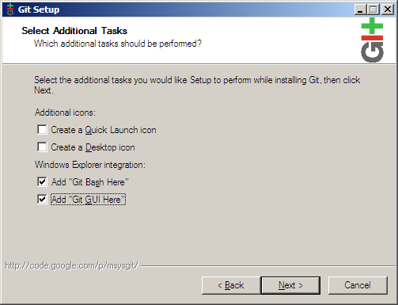

Pentru că vom folosi PuTTY în calitate de clientul nostru SSH, alegeţi _Use Plink_ şi completaţi calea pâna la fişierul descărcat executabil *plink.exe*.

image:images/git_plink.png[git plink.exe]

Faceţi click pe _Next_ pâna când nu se va finaliza instalarea.

== Crearea unui repositoriu

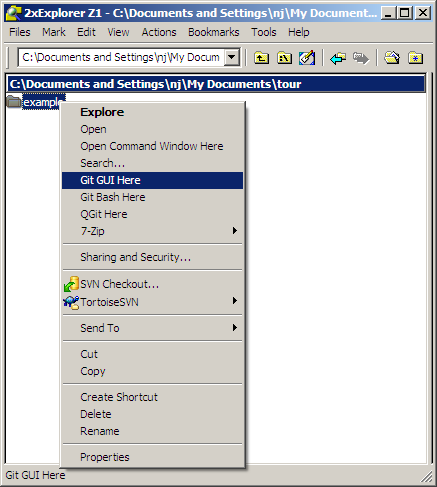

Pentru a crea un repositoriu, la început creaţi un folder de lucru pentru proiect. După care, faceţi click dreapta pe folder şi alegeţi _Git GUI Here_. Deoarece, deocamdată în acest folder nu există nici un repositoriu, se va afişa un dialog git gui de început.

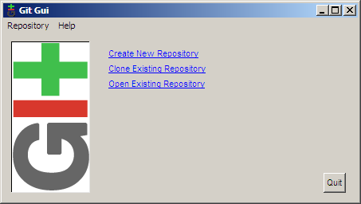

Alegeţi _Create New Repository_ şi se va afişa dialogul următor.

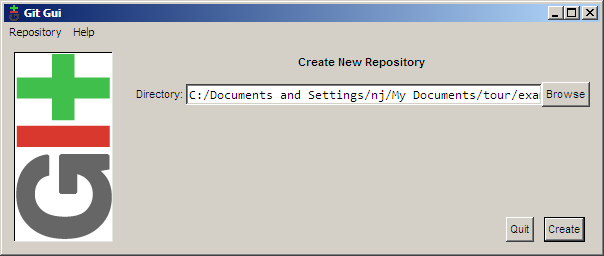

Selectaţi calea către folderul creat de dumneavoastră şi apăsaţi pe _Create_. Veţi vedea interfaţa de bază al git gui, ce va fi afişată, de acum încolo, de fiecare dată cand faceţi click dreapta pe folderul dumneavoastră şi apoi pe _Git GUI Here_.

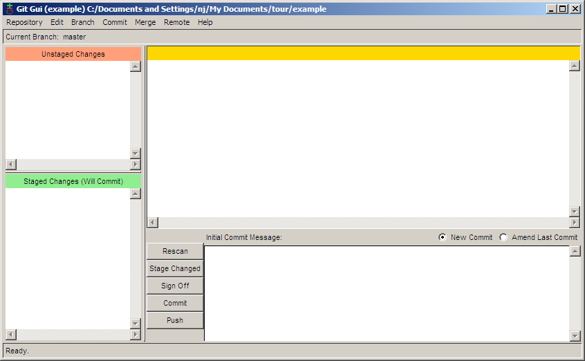

Acum că repositoriul a fost creat, trebuie să îi spuneţi lui git cine sunteţi pentru ca în mesajele de confirmare să fie indicat corect autorul. Pentru a face acest lucru, alegeţi _Edit → Options_.

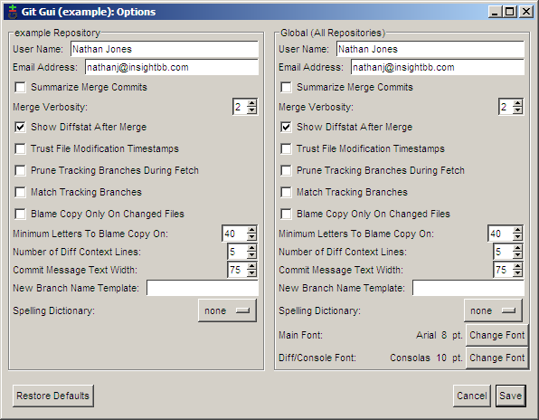

În dialogul de opţiuni există câte două versiuni pentru fiecare preferinţă. În partea stângă al dialogului sunt opţiunile care influenţează numai acest repositoriu, în timp ce partea dreaptă conţine opţiuni generale, care se aplică tuturor repositoriilor. Opţiunile implicite sunt acceptabile, aşa că, deocamdată, completaţi doar numele şi adresa de email. De asemenea, dacă aveţi un font preferat, îl puteţi seta acum.

== Confirmarea

Acum că repositoriul a fost creat, este timpul pentru a crea ceva
pentru a fi confirmat. Pentru acest exemplu, am creat un fişier numit
*main.c* cu următorul conţinut:

----
#include <stdio.h>

int main(int argc, char **argv)
{
        printf("Hello world!\n");
        return 0;
}
----

Apăsând pe butonul _Rescan_, îl veţi determina pe git gui să caute în folder fişiere noi, modificate sau şterse. În screenshotul ce urmează, git gui a găsit fişierul pe care l-am creat.

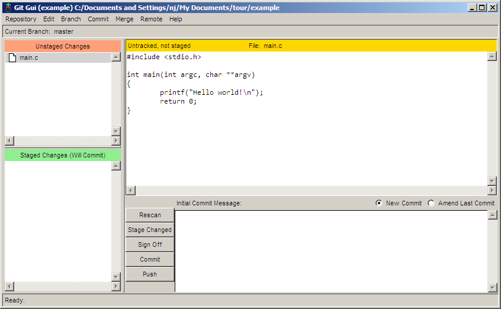

Pentru a adăuga fişierul pentru confirmare, apăsaţi pe pictograma din stânga numelui fişierului. Fişierul va fi mutat din panoul _Unstaged Changes_ în panoul _Staged Changes_. Acum putem adăuga un mesaj de confirmare şi să confirmăm modificarea cu ajutorul butonului _Commit_.

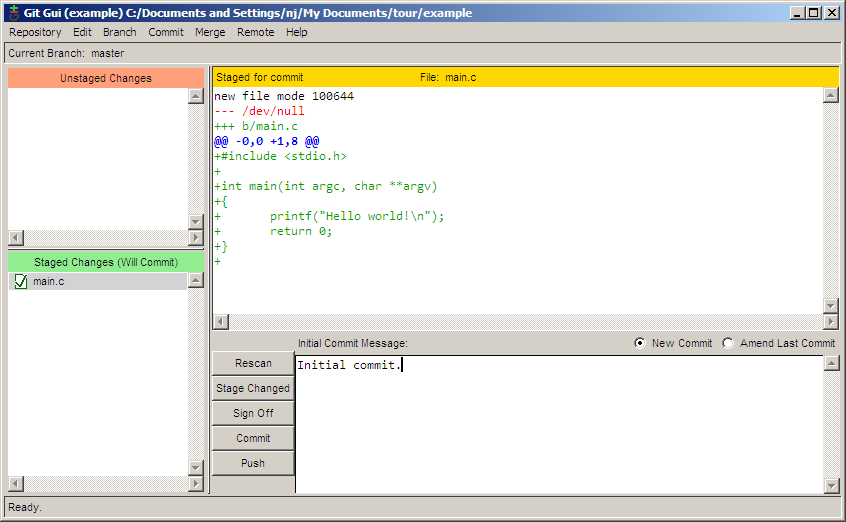

Este foarte frumos să saluţi lumea, dar eu vreau ca programul meu să fie mai personal. Hai să facem un program care îl salută pe utilizator. Aşa va arăta codul:

----
#include <stdio.h>
#include <string.h>

int main(int argc, char **argv)
{

        char name[255];
        printf("Enter your name: ");
        fgets(name, 255, stdin);
        printf("length = %d\n", strlen(name)); /* debug line */
        name[strlen(name)-1] = '\0'; /* remove the newline at the end */
        printf("Hello %s!\n", name);
        return 0;
}
----

Am avut unele probleme pentru că nu înţelegeam de ce noua linie era tipărită după numele utilizatorului, aşa că am adăugat o linie de depănare pentru a putea urmări acest lucru. Aş dori să confirm acest patch fără linia de depănare, dar vreau să o păstrez în copia mea de lucru pentru a continua depănarea. Cu git gui, acest lucru nu este o problemă. În primul rând, apăsaţi _Rescan_ pentru a căuta fişierul modificat. După care, apăsaţi pe pictograma din stânga numelui fişierului pentru a planifica toate modificările pentru confirmare. Apoi, faceţi click dreapta pe linia de depanare şi alegeţi _Unstage Line From Commit_.

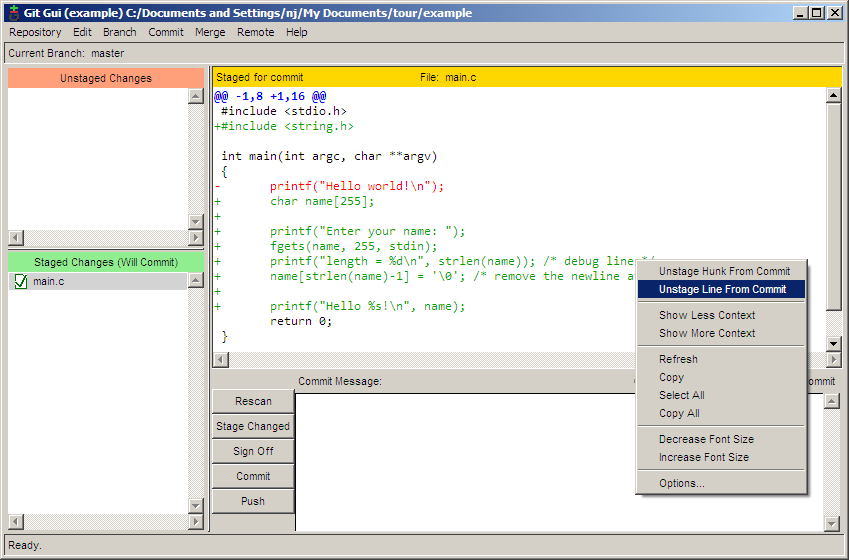

Acum, că linia de depanare a fost exclusă, iar celelalte modificări au fost planificate, trebuie doar să completăm mesajul de confirmare şi să apăsăm _Commit_.

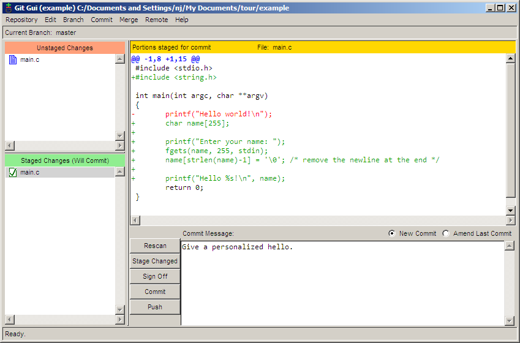

== Ramificarea

Să spunem că am dori să începem să adăugăm funcţii noi la versiunea următoare a programului nostru. În acelaşi timp am dori să pastrăm o versiune stabilă de întreţinere a programului pentru a putea repara eventualele erori. Pentru a face acest lucru, vom crea o ramură pentru proiectul nostru. Pentru a crea o nouă ramură în git gui, alegeţi _Branch → Create_. Funcţia pe care aş dori să o adaug, îl întreabă pe utilizator care este numele lui de familie, aşa că am numit această ramură *lastname*. Opţiunile implicite din dialogul Create Branch sunt potrivite, deci trebuie doar să introduceţi numele şi să apăsaţi _Create_.

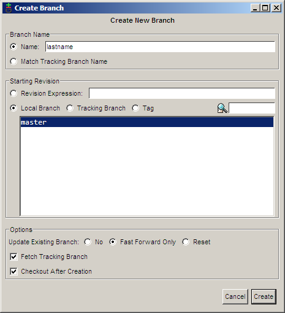

Acum, că sunt pe ramura *lastname*, pot să fac următoarele modificări:

----
#include <stdio.h>
#include <string.h>

int main(int argc, char **argv)
{
        char first[255], last[255];

        printf("Enter your first name: ");
        fgets(first, 255, stdin);
        first[strlen(first)-1] = '\0'; /* remove the newline at the end */

        printf("Now enter your last name: ");
        gets(last); /* buffer overflow? what's that? */

        printf("Hello %s %s!\n", first, last);
        return 0;
}
----

Acum pot confirma modificările. Observaţi că în cazul de faţă am folosit un alt nume pentru confirmare. Acest lucru îl vom discuta mai târziu. În mod normal, veţi folosi întotdeauna acelaşi nume când confirmaţi.

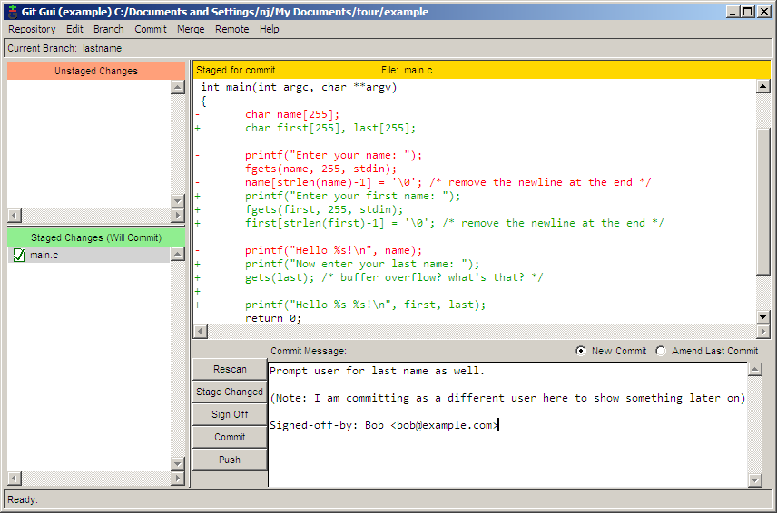

Între timp, un utilizator ne-a informat că neafişarea virgulei după adresarea directă către o persoană, este o eroare gravă. Pentru a putea repara această eroare în ramura stabilă, trebuie să ne întoarcem la ea. Acest lucru se face cu ajutorul _Branch → Checkout_.

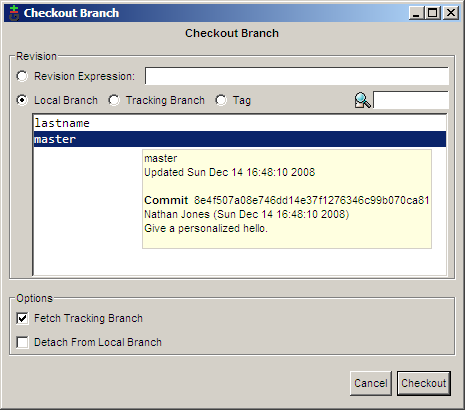

Acum putem repara eroarea.

image:images/git_gui_second_commit_branch.png[git gui second commit to
a branch]

Dacă alegem _Repository → Visualize All Branch History_, putem vizualiza istoricul modificărilor efectuate de noi.

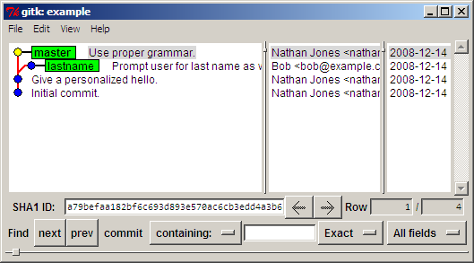

== Fuzionarea

După multe zile de muncă, am ajuns la concluzia că ramura noastră *lastname *este îndeajuns de stabilă pentru a fi fuzionată cu ramura *master*. Pentru a realiza fuziunea folosiţi _Merge → Local Merge_.

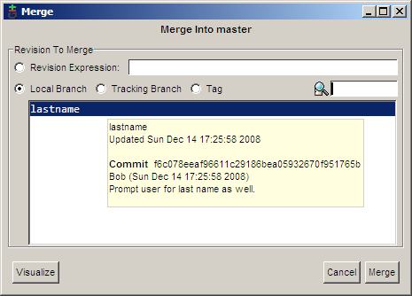

Din cauză că două confirmări diferite au produs două modificări diferite pe aceeaşi linie, va apărea un conflict.

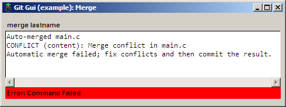

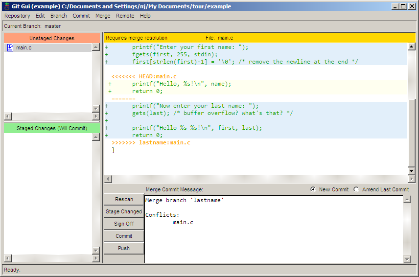

Acest conflict poate fi soluţionat folosind orice editor de text. După rezolvarea conflictului, planificaţi modificările prin apăsarea pictogramei fişierului şi apoi confirmaţi fuziunea prin apăsarea butonului _Commit_.

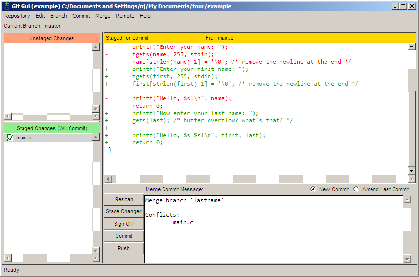

== Vizualizarea istoricului

Fişierul *main.c* a devenit destul de mare aşa că am decis să mut porţiunea din cod care întreabă numele utilizatorului într-o funcţie separată. În acelaşi timp am hotărât să mut funcţia într-un fişier separat. Acum repositoriul conţine următoarele fişiere: *main.c*, *askname.c* şi *askname.h*.

----
/* main.c */
#include <stdio.h>
#include "askname.h"

int main(int argc, char **argv)
{
        char first[255], last[255];

        askname(first, last);

        printf("Hello, %s %s!\n", first, last);
        return 0;
}
----

----
/* askname.c */
#include <stdio.h>
#include <string.h>

void askname(char *first, char *last)
{
        printf("Enter your first name: ");
        fgets(first, 255, stdin);
        first[strlen(first)-1] = '\0'; /* remove the newline at the end */

        printf("Now enter your last name: ");
        gets(last); /* buffer overflow? what's that? */
}
----

----
/* askname.h */

void askname(char *first, char *last);
----

image:images/git_gui_commit3.png[git gui commit 3 files]

Istoricul repositoriului poate fi vizualizat şi cercetat prin alegerea _Repository → Visualize All Branch History_. În următorul screenshot, încerc să găsesc commit-ul în care a fost adăugată variabila *last *prin căutarea tuturor commit-urilor în care a fost adăugat sau eliminat cuvântul *last*. Commit-urile care corespund condiţiilor de căutare apar cu litere aldine, ceea ce înlesneşte localizarea commit-ului dorit.

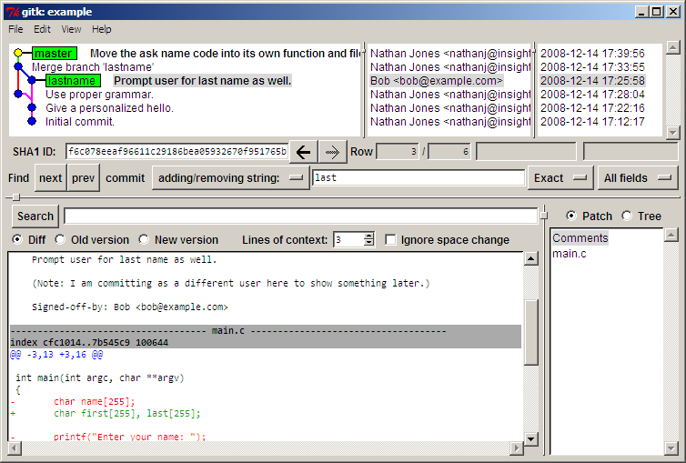

Câteva zile mai târziu, cineva se uită prin codul nostru şi vede că funcţia *gets *poate provoca o suprasolicitare a bufferului. Fiind o persoană căreia îi place să arate cu degetul, această persoană decide să ruleze un git blame ca să vadă cine a modificat ultimul acea linie de cod. Problema este că Bob este cel care a confirmat linia, dar eu am fost ultimul care s-a atins de ea în momentul în care am mutat-o într-un fişier separat. Evident, nu sunt eu de vină (bineînţeles). Este git destul de inteligent ca să înţeleagă acest lucru? Da, este.

Ca să rulaţi un blame, selectaţi _Repository → Browse master's Files_. Din arborele care apare, faceţi dublu click pe linia ce vă interesează, care în cazul de faţă este *askname.c*. Dacă ţinem mouse-ul pe linia care ne interesează, va apărea un indiciu cu toate informaţiile care ne interesează.

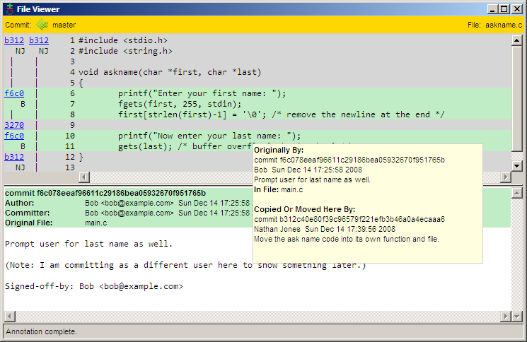

Aici putem vedea că linia a fost modificată pentru ultima dată de Bob în confirmarea *f6c0*, după care eu am mutat-o într-o altă locaţie în confirmarea *b312*.

== Publicarea modificărilor pe un server la distanţă

Înainte de a publica modificări pe un server la distanţă, trebuie să creaţi o pereche de chei SSH, una publică şi una privată. Utilizând SSH, veţi putea folosi autentificarea securizată care identifică dacă sunteţi acea persoană care pretindeţi a fi. Crearea perechii de chei este un proces simplu. Începeţi prin a rula programul *puttygen.exe *pe care l-aţi descărcat mai devreme. După aceea, faceţi click pe butonul _Generate_ pentru a genera cheile. După câteva secunde de procesare, apăsaţi pe butonul _Save private key_ pentru a salva noua cheie privată. Pentru a pregăti pasul următor, copiaţi cheia publică în memoria temporară. Vă recomand să nu apăsaţi butonul _Save public key_ pentru că fişierul salvat nu va fi într-un format strandard; încercarea de a-l folosi cu alte softuri ar putea fi problematică.

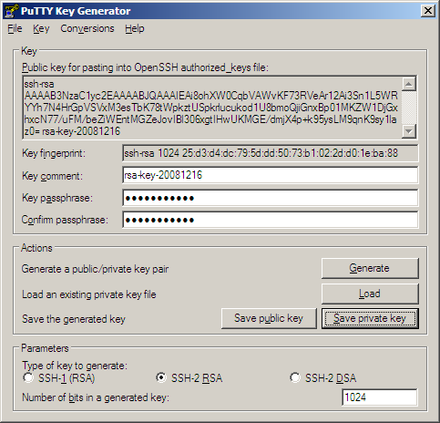

Acum că au fost generate cheile, serverul la distanţă trebuie să ştie de existenţa lor. Dacă doriţi să folosiţi github pentru a vă păstra codul, trebuie doar să mergeţi pe pagina contului dumneavoastră şi să înseraţi cheia publică.

TODO: screen shot from Assembla

Acum github are cheia noastră publică, dar noi nu o avem pe cea a githubului. Ca să corectaţi acest lucru, lansaţi *putty.exe*, conectaţi-vă la *github.com* şi apăsaţi _Yes_ pentru a accepta cheia publică a lui github. Puteţi închide, fără nici o problemă, fereastra de autentificare care apare după acceptarea cheii.

TODO: screen shot from assembla: site screen where to submit pub key

TODO: screenshot from assembla: accept ssh key

Trebuie să încărcăm cheia privată pentru a o putea folosi cu cheia publică, pentru aceasta lansaţi *pageant.exe*. Acest program va crea o pictogramă în system tray. Dublu click pe această pictogramă va deschide o fereastră în care poate fi adăugată cheia privată. După adăugarea cheii, agentul va rula în spate şi va efectua autentificarea la nevoie.

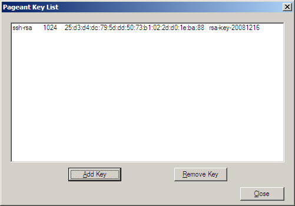

Acum că serverul şi clientul nostru se pot identifica reciproc, este timpul să publicăm. _Remote → Push_ va deschide dialogul de publicare. Introduceţi adresa confirmărilor proiectului şi apăsaţi _Push_, modificările vor fi trimise.

TODO: 2 images

Bineînţeles că introducerea adresei de fiecare dată când vrem să publicăm devine iritantă la un moment dat. În schimb, git ne permite să asociem adrese lungi folosind remotes. În prezent, git gui nu are o modalitate de a adăuga un remote, de aceea trebuie folosită o linie de comandă.

----
git remote add origin git@git.assembla.com:example.git
----

Notă: După adăugarea unui remote, închideţi şi redeschideţi git gui pentru ca noul remote să fie recunoscut.

Acum remote-ul *origin* este asociat cu adresa *git@github.com:nathanj/example.git*. Acum la vizualizarea dialogului de publicare în git gui va apărea o listă cu remote-uri existente.

todo image

== Recepţionarea modificărilor de pe server la distanţă

Deoarece codul nostru este atât de util, zeci de oameni au descărcat şi utilizează acum programul nostru. Una din aceste persoane, Fred, a decis să ramifice proiectul nostru şi să adauge modificările proprii. După ce a adăugat codul său, el ar dori ca să transferăm confirmările lui din repositoriul său într-al nostru. Pentru a face acest lucru, pentru început creaţi un alt remote.

----
git remote add fred ssh://fred@192.168.2.67/home/fred/example
----

Acum putem recepţiona modificările făcute de Fred utilizând _Remote → Fetch from → fred_.

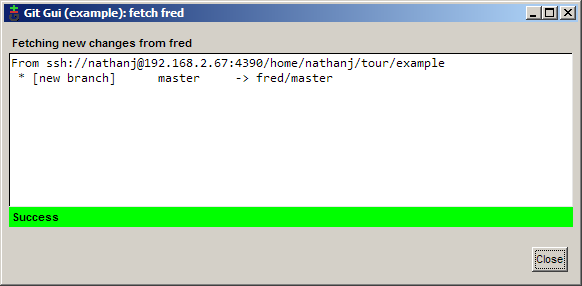

După extragere, confirmările lui Fred au fost adăugate în repositoriul nostru local în ramura *remotes/fred/master*. Putem folosi gitk pentru a vizualiza modificările făcute de Fred.

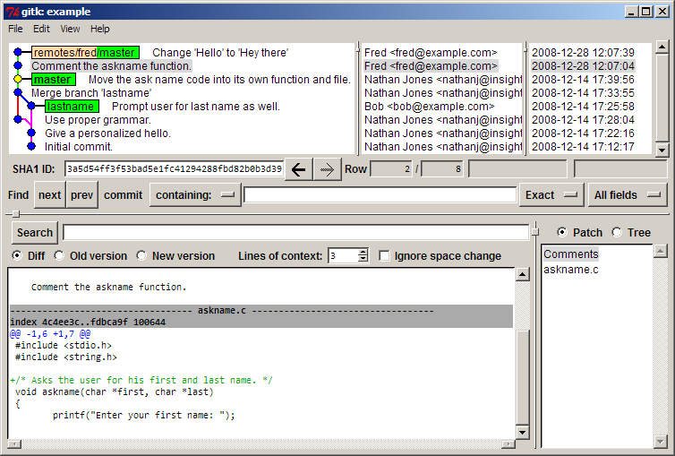

Dacă ne plac toate modificările făcute de Fred, putem efectua o fuziune normală, la fel cum am făcut mai devreme. În acest caz, îmi place o singură modificare făcută de Fred. Pentru a fuziona o singură modificare făcută de Fred, faceţi click dreapta pe confirmarea respectivă şi alegeţi _Cherry-pick this commit_. Confirmarea va fuziona în ramura curentă.

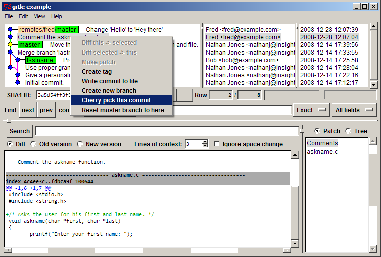

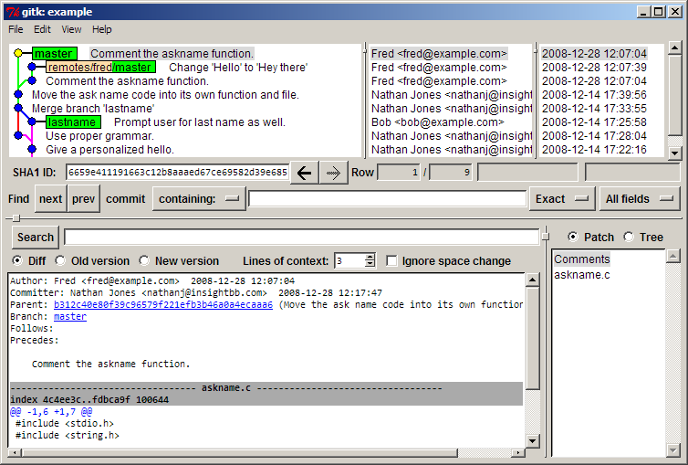

Acum putem publica patch-ul lui Fred în arborele nostru github pentru ca toată lumea să îl poată vedea şi folosi.

TODO: Assembla image

== Concluzii

În acest ghid, am arătat cum se pot îndeplini sarcini obişnuite în git utilizând uneltele GUI. Sper că acest ghid a arătat că este nu doar posibil, ci şi uşor de folosit git pe platforma Windows fără a fi nevoie de Windows shell pentru efectuarea mojorităţii operaţiilor.
